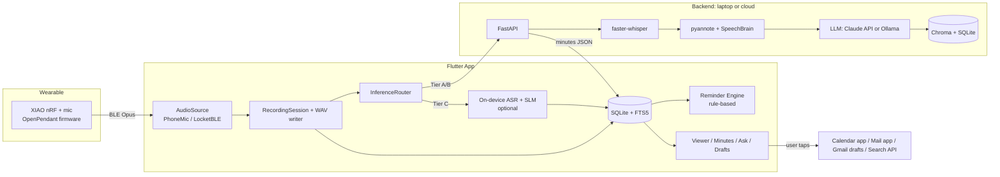
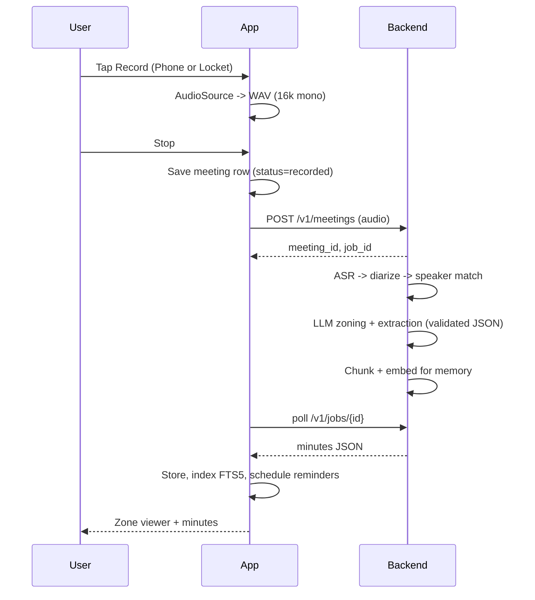
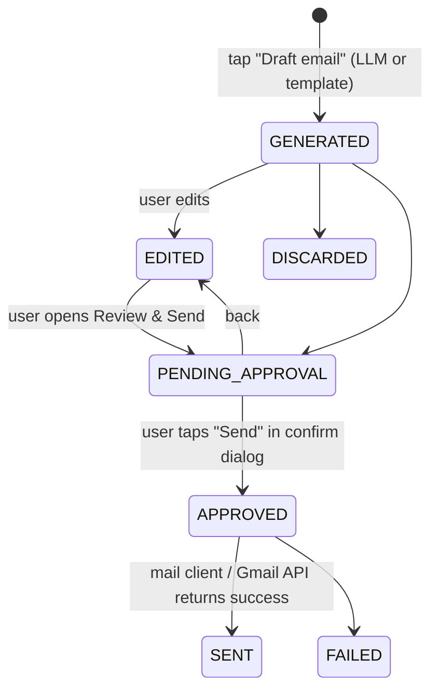

# 02 — System Architecture

## 1. Context diagram

## 2. Components
| Component | Responsibility | Tech |
|-----------|----------------|------|
| Firmware | Capture mic, Opus encode, stream over BLE (unchanged from v1) | nRF Connect SDK / Zephyr (existing) |
| AudioSource layer | Uniform PCM stream from either input | Dart |
| RecordingSession | Chunked WAV on disk, level meter, duration, recovery | Dart |
| InferenceRouter | Chooses Tier A/B/C from connectivity and settings | Dart |
| Backend API | Jobs, pipeline, memory, drafts | FastAPI |
| ASR | Timestamped transcript | faster-whisper |
| Diarization + Speaker ID | Turns + names | pyannote 3.1, SpeechBrain ECAPA |
| LLM service | Zoning, extraction, recap, drafts, intent | Claude API / Ollama (Qwen, Llama) behind one interface |
| Memory | Chunk, embed, retrieve, cite | Chroma + bge-small; FTS5 on device |
| Reminder Engine | Deterministic scheduling | Dart + flutter_local_notifications |
| Draft Manager | Draft state machine + approval gate | Dart |
| Scheduler | Daily summary, overdue nudges | Local notifications |

## 3. Key data flows

### 3.1 Record → minutes

### 3.2 Action → reminder (fully local)
Action saved with deadline + priority → `ReminderRules.compute()` → rows in `reminders` → `zonedSchedule` notifications. Editing the action cancels and recomputes. No network involved.

### 3.3 Action → email draft with human approval

Only `APPROVED` may call the send/handoff function, and `APPROVED` can only be set by a tap in the confirm dialog (see file 07).

### 3.4 Ask memory
Query → (online) embed + Chroma top-k + LLM answer with citations; (offline) FTS5 BM25 top-k → SLM or extractive answer from structured minutes.

## 4. Deployment topologies
| Tier | Where AI runs | Internet needed | Use |
|------|---------------|-----------------|-----|
| A Cloud | Backend with Claude API + faster-whisper | Yes | Best quality, main demo |
| B Local server | Laptop backend + Ollama (Qwen/Llama) + faster-whisper, phone on same hotspot/LAN | No | "Offline" demo with strong quality |
| C On-device | whisper.cpp/sherpa-onnx + small LLM on phone | No | Offline recap; stretch |

Fallback chain: A → B → C → "recorded, will process later" queue.

## 5. Failure modes and mitigations
| Failure | Detection | Behaviour |
|---------|-----------|-----------|
| BLE drop | No packets for 3 s | Banner, keep partial WAV, offer Continue on phone |
| Backend unreachable | Timeout / health check | Queue upload, retry with backoff, fall to next tier |
| LLM invalid JSON | Pydantic validation fails | Repair prompt once, then cached/simple heuristic zoning |
| Whisper slow | Job progress stalls | Smaller model option, chunked processing |
| Notification permission denied | Runtime check | In-app banner explaining; reminders listed in-app |
| Exact alarm not permitted | Android check | Fall back to inexact scheduling, warn user |
| App killed mid-recording | Partial WAV exists on restart | Recovery dialog to finalize |

## 6. Security and privacy
- Consent prompt + recording indicator (UI badge; LED if firmware supports it).
- API keys only on the backend; the app uses a single backend URL + a shared secret token for the hackathon.
- Data at rest: app-private storage; delete cascades to audio, transcript, embeddings.
- No automatic outbound messages. Network egress is limited to our backend and optional search for thoughts.
- Logs never contain transcript text in production mode.

## 7. Observability (cheap but useful)
Per-job timings (ASR, diarize, LLM), model names, token counts, validation failures; a `/debug` page in the backend and a hidden debug screen in the app showing the last job JSON.

## 8. Post-hackathon scaling notes
Accounts + sync, queue (Redis/RQ), object storage, streaming ASR, per-user vector stores, encrypted storage, iOS, enclosure + battery, firmware VAD to save power.
